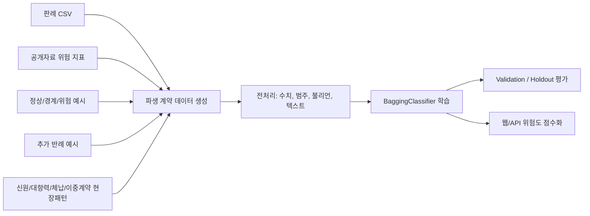

# 자동화된 부동산 기망·사기 및 불법 행위 탐지 시스템

전세·월세·매매 계약 전 단계에서 사용자의 계약 정보를 입력받아 위험 신호를 분석하는 오프라인 AI 연구/시연 프로젝트입니다. 출력은 `안전 / 주의 / 위험` 등급, 0~100점 위험 점수, 주요 위험 근거입니다.

이 시스템은 사기 여부를 법적으로 단정하지 않습니다. 실제 법적 판단은 수사기관과 법원의 영역이며, 본 프로젝트는 계약 전 2차 확인을 위한 위험 신호 탐지 도구입니다.

## 핵심 구현

- 원본 데이터: `데이터/real_estate_fraud_cases_filtered.csv`
- 파생 학습 데이터: `데이터/derived_contract_cases.csv`
- 현실형 테스트 사례: `데이터/manual_test_scenarios.csv`
- 학습 알고리즘: `sklearn.ensemble.BaggingClassifier`
- 기본 추정기: `DecisionTreeClassifier`
- 웹 데모: Python 표준 라이브러리 `http.server` 기반 로컬 앱
- 테스트: `pytest`

## 제출 설명 순서

1. 문제 정의: 사기 여부를 단정하지 않고 계약 전 위험 신호를 `안전 / 주의 / 위험`으로 점수화합니다.
2. 데이터 구축: 판례 CSV, 공개자료 기반 위험 지표, 정상/경계/위험 파생 계약 데이터, 추가 반례 데이터를 오프라인으로 결합합니다.
3. 모델 학습: `BaggingClassifier`가 수치·범주·불리언·텍스트 피처를 함께 학습합니다.
4. 평가: 같은 판례에서 파생된 데이터가 train/test에 동시에 섞이지 않도록 `source_case_number` 그룹 분리를 사용합니다.
5. 시연: 사용자가 계약 정보를 입력하면 Bagging 확률과 규칙 기반 점수를 섞어 최종 위험도를 보여줍니다.

## 폴더 구조

```text
학습/
  데이터/
    real_estate_fraud_cases_filtered.csv
    derived_contract_cases.csv
    data_quality_report.json
    manual_test_scenarios.csv
    public_risk_indicators.csv
    external_case_references.csv
    offline_reference_sources.md
  models/
    bagging_risk_model.joblib
    metadata.json
  scripts/
    build_datasets.py
    train_model.py
    predict.py
    run_web.py
  src/risk_detector/
    data/
    features/
    model/
    risk/
    web/
  tests/
  학습과정/
    training_report.md
    model_card.md
    training_audit.json
    metrics.json
    confusion_matrix.csv
    feature_importance.csv
    prediction_examples.csv
    manual_scenario_predictions.csv
    feature_notes.md
    test_results.md
    web_demo_desktop_final.png
    web_demo_result_desktop_final.png
    web_demo_mobile_final.png
    real_estate_risk_training_explained.ipynb
```

## 실행 방법

```bash
cd /Users/heodongun/Desktop/크롤링/학습
python3 -m venv .venv
.venv/bin/python -m pip install -r requirements.txt
PYTHONPATH=src .venv/bin/python scripts/build_datasets.py
PYTHONPATH=src .venv/bin/python scripts/train_model.py
PYTHONPATH=src .venv/bin/python -m pytest
PYTHONPATH=src .venv/bin/python scripts/run_web.py
```

웹 데모 기본 주소:

```text
http://127.0.0.1:8765
```

## 단일 예측 CLI 예시

```bash
PYTHONPATH=src .venv/bin/python scripts/predict.py --json '{
  "contract_type": "jeonse",
  "property_type": "villa",
  "region": "수도권",
  "deposit_million": 270,
  "estimated_market_price_million": 290,
  "mortgage_million": 115,
  "senior_claim_million": 30,
  "provisional_seizure": true,
  "landlord_prior_incidents": true,
  "broker_advertising_issue": true,
  "suspicious_special_clause": true,
  "guarantee_insurance_available": false,
  "special_clause_text": "채권양도와 담보 제공에 이의를 제기하지 않는다."
}'
```

## 학습 결과

최근 학습 결과:

- 전체 데이터: `100,488`행
- 학습/검증/홀드아웃: `65,822 / 14,546 / 20,120`
- Validation Macro F1: `0.9899`
- Holdout Accuracy: `0.9847`
- Holdout Balanced Accuracy: `0.9846`
- Holdout Macro F1: `0.9844`
- Holdout Weighted F1: `0.9847`
- Bagging estimators: `400`
- 추가학습: 전세가율·법적 신호 반례 `16,000`건 + 신원/대항력/체납/이중계약 현장패턴 `18,000`건 추가
- 분리 방식: `source_case_number` 기준 그룹 분리

학습 과정 설명 노트북:

- `학습과정/real_estate_risk_training_explained.ipynb`

상세 파일:

- `학습과정/training_report.md`
- `학습과정/model_card.md`
- `학습과정/training_audit.json`
- `학습과정/metrics.json`
- `학습과정/classification_report.txt`
- `학습과정/confusion_matrix.csv`
- `학습과정/feature_importance.csv`
- `학습과정/prediction_examples.csv`
- `데이터/data_quality_report.json`
- `데이터/public_risk_indicators.csv`
- `데이터/external_case_references.csv`

## 웹 시연 검증

- 로컬 주소: `http://127.0.0.1:8765`
- API health: `GET /api/health` 200, `model_exists=true`
- API 예측: `POST /api/predict` 200, 안전 전세 예시 `안전 34.4점`, 고위험 기본 예시 `위험 85.9점`
- 자동 테스트: `8 passed in 4.75s`
- 브라우저 콘솔: 메시지 없음
- 데스크톱/모바일 캡처:
  - `학습과정/web_demo_desktop_final.png`
  - `학습과정/web_demo_result_desktop_final.png`
  - `학습과정/web_demo_mobile_final.png`

## Bagging을 사용한 이유

부동산 계약 위험은 전세가율 하나로 결정되지 않습니다. 근저당, 선순위채권, 압류·가압류, 신탁, 위반건축물, 중개사 설명 부족, 허위광고, 특약 내용처럼 여러 신호가 조합될 때 위험도가 높아집니다.

Bagging은 여러 결정트리를 bootstrap 표본으로 학습한 뒤 예측을 집계합니다. 단일 트리보다 특정 파생 데이터 패턴에 과적합될 위험을 줄이고, 다양한 위험 신호 조합을 안정적으로 반영할 수 있어 이 주제의 기술적 배경으로 적합합니다.

## 학습 파이프라인



모델 예측은 `BaggingClassifier` 확률을 사용하고, 최종 서비스 점수는 명시적 규칙 점수를 함께 반영합니다. 이 구조는 모델이 놓친 고위험 법적 신호를 규칙으로 보완하고, 정상 계약은 낮은 전세가율·낮은 부채비율·보증보험 가능 여부 같은 안전 신호로 낮게 점수화하기 위한 설계입니다.

## 사용한 입력 피처

- 금액/비율: 보증금, 월세, 매매가, 추정 시세, 전세가율, 부채비율, 주변 시세 괴리율
- 등기부 권리관계: 근저당, 선순위채권, 압류, 가압류/가처분, 신탁
- 건축물 위험: 위반건축물 여부
- 임대인/중개사 위험: 임대인 사고 이력, 다주택 반환 부담, 무등록 중개, 허위·과장 광고, 확인설명 부족
- 보호 요건: 전입신고, 확정일자, 보증보험 가능 여부
- 텍스트: 계약서 특약, 사용자 상황, 판례 기반 위험 키워드, 명의 불일치, 대리권 서류 미확인, 전입신고 지연, 당일 근저당, 체납, 이중계약 신호

## 오프라인 공개자료 기준

런타임은 외부 API를 호출하지 않지만, 피처 설계에는 다음 공식 자료를 참고했습니다.

- 국토교통부 실거래가 공개시스템: https://rt.molit.go.kr/pt/info/info.do?mobileAt=v
- 공공데이터포털 `국토교통부_아파트 매매 실거래가 자료`: https://www.data.go.kr/data/15126469/openapi.do
- 공공데이터포털 `국토교통부_건축HUB_건축물대장정보 서비스`: https://www.data.go.kr/data/15134735/openapi.do
- 공공데이터포털 `국토교통부_공동주택 기본 정보제공 서비스`: https://www.data.go.kr/data/15058453/openapi.do
- HUG 전세보증금반환보증 상품개요: https://m.khug.or.kr/hug/web/ig/dr/igdr000001.jsp?tabMenu=Y
- HUG 전세 및 임대보증 공공데이터: https://khug.or.kr/houstar/web/p03/01/p030105.jsp?articleId=34712&currentPage=1&mode=S
- 대법원 인터넷등기소: https://www.iros.go.kr
- 국가법령정보센터: https://www.law.go.kr
- 전세보증금 부풀림/허위계약 판결 보도 참조: https://www.hankyung.com/article/202506220823i

## 한계

- 파생 계약 예시는 판례와 공개 기준을 바탕으로 만든 학습용 데이터이며 실제 피해자 원천 기록이 아닙니다.
- 실제 등기부등본, 건축물대장, 실거래가를 자동 조회하지 않습니다.
- 국가법령정보 OPEN API는 등록 IP/도메인 검증이 필요해 현재 로컬 환경에서 대량 호출하지 못했고, 접근 가능한 공개 페이지와 오프라인 참조 CSV로 대체했습니다.
- 웹 데모는 연구 시연용이며 법률 자문 서비스가 아닙니다.
- 모델 성능은 파생 데이터 기준 평가 결과이므로 실제 계약 현장 성능과 동일하게 해석하면 안 됩니다.
